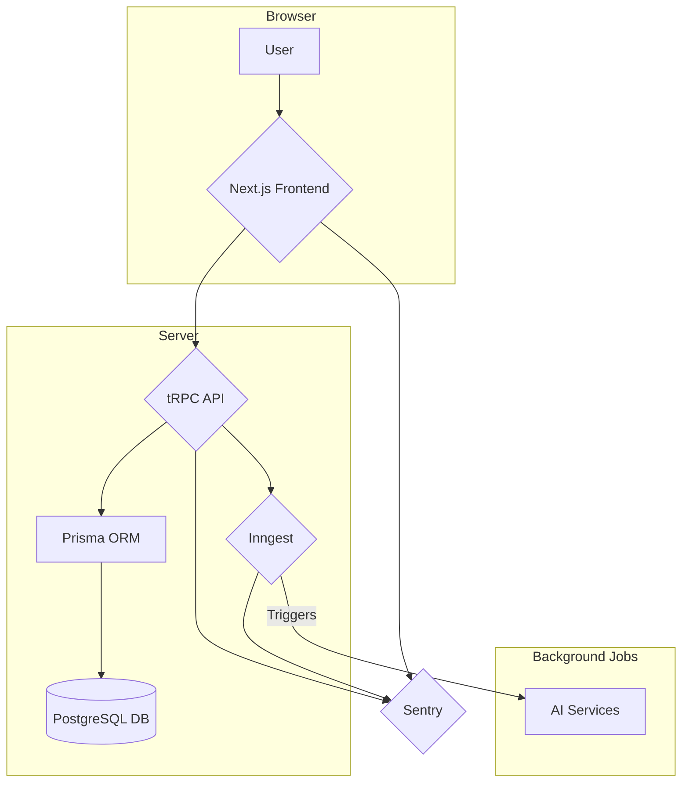

# Aethon

Aethon is a full-stack application built with Next.js that demonstrates how to offload heavy tasks to background jobs using Inngest. It includes a user dashboard for managing workflows, credentials, and subscriptions, and leverages AI services for background processing.

## Tech Stack

- **Framework:** [Next.js](https://nextjs.org/)
- **Language:** [TypeScript](https://www.typescriptlang.org/)
- **UI:** [shadcn/ui](https://ui.shadcn.com/), [Radix UI](https://www.radix-ui.com/), [Tailwind CSS](https://tailwindcss.com/)
- **API:** [tRPC](https://trpc.io/)
- **Database:** [Prisma](https://www.prisma.io/) with [PostgreSQL](https://www.postgresql.org/)
- **Background Jobs:** [Inngest](https://www.inngest.com/)
- **Authentication:** [@polar-sh/better-auth](https://github.com/polarsource/better-auth)
- **AI:** [AI SDK](https://sdk.vercel.ai/docs) (Google, OpenAI, Anthropic)
- **Error Tracking:** [Sentry](https://sentry.io/)

## Project Structure

- `app/`: Contains the Next.js pages and layouts.
- `components/`: Shared React components.
- `features/`: Modularized features, each containing its own components, hooks, and server-side logic.
- `inngest/`: Inngest client and background job definitions.
- `prisma/`: Database schema and migrations.
- `trpc/`: tRPC routers and initialization.

## Architecture Diagram



## Getting Started

1.  **Install dependencies:**
    ```bash
    npm install
    ```

2.  **Set up your environment variables:**
    Create a `.env` file and add the necessary environment variables (e.g., `DATABASE_URL`, AI API keys).

3.  **Run the development server:**
    ```bash
    npm run dev:all
    ```
    This will start the Next.js development server and the Inngest development server.