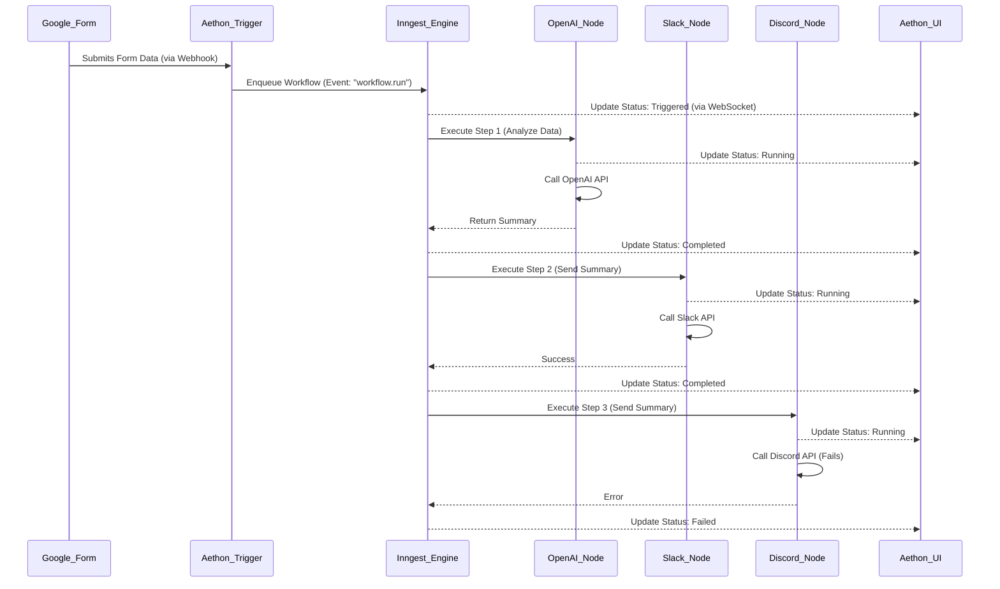

# 🚀 Aethon: Your Next-Gen Visual Workflow Automation Platform 🚀

Welcome to **Aethon**! This project is a deep dive into building a scalable, production-ready, and feature-rich workflow automation platform using a modern, full-stack architecture. We're crafting a powerful SaaS application where you can visually design, execute, and monitor complex workflows, connecting all your favorite apps and services.

## ✨ The Aethon Vision: Why Visual Automation?

Imagine a platform where you can automate tedious tasks without writing a single line of code. Where you can connect your tools with a simple drag-and-drop interface, watch your data flow in real-time, and have confidence that your processes are running reliably in the background. That's the power of visual workflow automation, and that's the vision for Aethon!

We are building a complete SaaS layer on top of a powerful automation engine, providing:

-   **Scalability:** The architecture is designed to handle a high volume of workflow executions, with background jobs processed efficiently by Inngest.
-   **Resilience:** A failure in one node doesn't stop the entire workflow. Inngest manages retries and provides clear error states, allowing you to debug with ease.
-   **Agility:** The node-based system makes it incredibly easy to add new integrations and expand the platform's capabilities. The only limit is your imagination.
-   **Real-time Observability:** See exactly what's happening, as it happens. No more guessing games or digging through logs to understand the state of your automation.

## 🗺️ Architectural Blueprint: How It All Connects

Aethon is designed as a cohesive, full-stack application leveraging the best of the modern web ecosystem. It provides a seamless experience from the visual canvas in the browser right down to the background job execution.

-   **Frontend (Next.js & React):** The user interface is a highly interactive and responsive application built with Next.js. It features the visual canvas for creating and managing workflows.
-   **API Layer (tRPC):** The frontend communicates with the backend via a type-safe tRPC API. This ensures that data flowing between the client and server is always consistent and predictable.
-   **Background Engine (Inngest):** The heart of the automation. When a workflow is triggered, the backend offloads the execution to Inngest. Inngest manages the entire lifecycle of the workflow, executing each node's logic, handling retries, and providing real-time status updates back to the frontend via its built-in event-driven, WebSocket-based communication.
-   **Database (Prisma & Neon):** All application data, including users, workflows, and subscription details, is stored in a serverless Postgres database from Neon and accessed via the Prisma ORM for type-safe queries.
-   **Authentication (Better Auth):** Manages user sign-up, login, and session management, providing a secure foundation for the SaaS platform.
-   **Payments (Polar):** Handles everything related to subscriptions, including free tiers, paid plans, and checkout flows, allowing you to ship and charge for the platform.
-   **Monitoring (Sentry):** Provides deep insights into the application's health, from frontend errors to backend performance and detailed AI model monitoring.

## 🚀 Getting Started: Build Your First Workflow!

Ready to dive in? Follow the steps below to get Aethon up and running on your local machine.

### Prerequisites

-   Node.js and npm
-   A PostgreSQL database (e.g., from [Neon](https://neon.tech/))
-   API keys for any services you want to integrate (e.g., OpenAI, Google AI, Polar, Sentry).

### Installation & Setup

1.  **Clone the repository:**
    ```bash
    git clone <repository-url>
    cd aethon
    ```

2.  **Install dependencies:**
    ```bash
    npm install
    ```

3.  **Set up environment variables:**
    Create a `.env.local` file by copying the `.env.example` file. Fill in the required environment variables.
    ```bash
    cp .env.example .env.local
    ```

4.  **Run database migrations:**
    ```bash
    npx prisma db push
    ```

5.  **Run the development servers:**
    This command uses `mprocs` to start the Next.js app and the Inngest dev server concurrently.
    ```bash
    npm run dev:all
    ```

Your application should now be running at `http://localhost:3000`.

## 🔑 Environment Variables

Your `.env.local` file will need the following keys for the application to run correctly:

-   `DATABASE_URL`: The connection string for your PostgreSQL database.
-   `INNGEST_EVENT_KEY`: Your event key from Inngest.
-   `GOOGLE_GENERATIVE_AI_API_KEY`: Your Google AI API key.
-   `OPENAI_API_KEY`: Your OpenAI API key.
-   `ANTHROPIC_API_KEY`: Your Anthropic API key.
-   `POLAR_SUCCESS_URL`: The success URL for Polar checkouts.
-   *(Add other auth and Sentry variables as needed)*

## 📊 Architecture and Flow Diagrams

### High-Level Architecture

```mermaid
graph TD
    subgraph "User Interface (Next.js)"
        A[Visual Canvas]
        B[Node Configuration]
        C[Dashboard]
        A -- Interacts with --> D{tRPC API}
        B -- Interacts with --> D
        C -- Interacts with --> D
        E[Real-time UI Updates]
    end

    subgraph "Backend (Next.js Server)"
        D -- Manages --> F[Workflows]
        D -- Manages --> G[Users & Auth]
        D -- Manages --> H[Subscriptions]
        D -- Triggers --> I{Inngest}
        G -- Handled by --> J[Better Auth]
        H -- Handled by --> K[Polar]
    end

    subgraph "Data & State"
        F -- Stored in --> L[(Neon DB via Prisma)]
        G -- Stored in --> L
        H -- Stored in --> L
    end

    subgraph "Background Processing (Inngest)"
        I -- Executes --> M[Workflow Steps]
        M -- Calls --> N[External APIs <br/>(Google, OpenAI, Slack...)]
        I -- Pub/Sub --> E
    end

    subgraph "Monitoring"
        D -- Reports to --> O{Sentry}
        I -- Reports to --> O
    end
```

### Example Workflow: Customer Feedback Automation

This diagram illustrates a practical use case: summarizing customer feedback from a Google Form and notifying the team.



## 🛠️ Core Technologies Powering Aethon

-   **Framework:** [Next.js](https://nextjs.org/) (App Router)
-   **Language:** [TypeScript](https://www.typescriptlang.org/)
-   **API Layer:** [tRPC](https://trpc.io/)
-   **Database:** [Prisma](https://www.prisma.io/) ORM with [Neon](https://neon.tech/) Serverless Postgres
-   **Background Jobs & WebSockets:** [Inngest](https://www.inngest.com/)
-   **Authentication:** [Better Auth](https://github.com/polarsource/better-auth)
-   **Payments & Subscriptions:** [Polar](https://polar.sh/)
-   **UI:** [shadcn/ui](https://ui.shadcn.com/), [Tailwind CSS](https://tailwindcss.com/), [Radix UI](https://www.radix-ui.com/)
-   **Monitoring:** [Sentry](https://sentry.io/)
-   **AI:** [Vercel AI SDK](https://sdk.vercel.ai/docs)

## 👋 Contributing: Be a Part of Aethon!

We welcome contributions from everyone! Whether it's a bug fix, a new feature, or an improvement to the documentation, your input is invaluable. Please feel free to open an issue or submit a pull request. Let's build something amazing together!