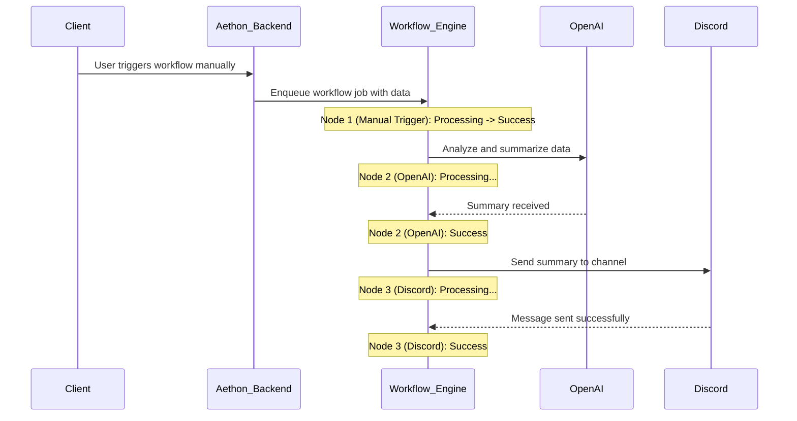

# 🚀 Aethon: Your Open-Source Workflow Automation Platform 🚀

Welcome to **Aethon**! This project is building a powerful, open-source workflow automation tool that allows you to connect different apps and services, automate processes, and visualize your data flows in real-time.

## ✨ The Aethon Vision: Visual Automation for Everyone

Imagine a world where you can visually create complex workflows without writing a single line of code. Where you can see your data flowing from one step to the next, and instantly know when something goes right or wrong. That's the vision for Aethon.

We are building a platform that empowers developers and creators to build powerful automations with a simple, intuitive drag-and-drop interface.

-   **Visual & Intuitive:** A clean, node-based canvas for designing, managing, and visualizing your workflows.
-   **Real-time Feedback:** See the status of each node in your workflow as it executes. No more guessing games.
-   **Extensible:** The platform is designed to be easily extended. You can create your own nodes and integrations to fit your custom needs. The only limit is your imagination.
-   **Full SaaS Platform:** Aethon is not just a tool, it's a full-fledged SaaS platform with payments, subscriptions, and user management built-in.

## 🗺️ Architectural Blueprint: How It All Connects

Aethon is built on a modern, robust, and scalable tech stack to deliver a seamless and real-time user experience.

-   **Framework:** The entire application is built with **Next.js**, providing a powerful React framework for both the frontend and backend.
-   **Real-time Engine:** We use a powerful job execution engine powered by **Ingest** for background job processing, retries, and pub/sub messaging. This, combined with **WebSockets**, provides the real-time visual feedback on the workflow canvas.
-   **Database:** We use **Prisma** as our ORM for type-safe database access, connected to a serverless **Neon** Postgres database.
-   **Authentication:** User authentication and management are handled by **Better Auth**, a modern and flexible authentication solution for Next.js.
-   **Payments & Subscriptions:** The SaaS layer is powered by **Polar**, handling payments and subscriptions seamlessly.
-   **Monitoring & Error Tracking:** We use **Sentry** for comprehensive error tracking, logging, session replays, and even monitoring the performance and token usage of our AI integrations.

## 🚀 Getting Started: Join the Aethon Journey!

Ready to dive in and start building your own automations? Follow the steps in the [Local Development](#-local-development) section to get Aethon running on your machine.

## 🏡 Local Development

Follow these steps to get Aethon up and running on your local machine:

1.  **Clone the repository:**
    ```bash
    git clone https://github.com/your-username/aethon.git
    cd aethon
    ```
2.  **Install dependencies:**
    ```bash
    npm install
    ```
3.  **Set up environment variables:**
    Create a `.env` file in the root of the project by copying the example file:
    ```bash
    cp .env.example .env
    ```
    Then, fill in the necessary variables in the `.env` file. See the [Environment Variables](#-environment-variables) section for more details.

4.  **Set up the database:**
    ```bash
    npx prisma generate
    npx prisma db push
    ```

5.  **Run the development server:**
    ```bash
    npm run dev
    ```
    The application will be available at `http://localhost:3000`.

## 🔑 Environment Variables

You will need to create a `.env` file in the root of the project with the following variables. You can use the `.env.example` file as a starting point.

```env
# Database
DATABASE_URL="your_neon_database_url"

# Authentication (Better Auth)
BETTER_AUTH_SECRET="your_better_auth_secret"

# Payments (Polar)
POLAR_API_KEY="your_polar_api_key"

# Monitoring (Sentry)
SENTRY_DSN="your_sentry_dsn"

# Integrations
OPENAI_API_KEY="your_openai_api_key"
GEMINI_API_KEY="your_gemini_api_key"
CLAUDE_API_KEY="your_anthropic_api_key"

# Google (for Google Form triggers, etc.)
GOOGLE_CLIENT_ID="your_google_client_id"
GOOGLE_CLIENT_SECRET="your_google_client_secret"

# Stripe (for Stripe event triggers)
STRIPE_SECRET_KEY="your_stripe_secret_key"
STRIPE_WEBHOOK_SECRET="your_stripe_webhook_secret"

# Webhooks for Messaging
DISCORD_WEBHOOK_URL="your_discord_webhook_url"
SLACK_WEBHOOK_URL="your_slack_webhook_url"
```

## 🌟 Core Features Spotlight

### The Canvas
The heart of Aethon is the drag-and-drop canvas where you bring your automations to life.

### Trigger Nodes
Start your workflows from a variety of sources:
-   **Manual:** Trigger a workflow with a single click.
-   **Webhook:** Create a unique URL to start a workflow from any service that supports webhooks.
-   **Google Forms:** Kick off a workflow every time a form is submitted.
-   **Stripe Events:** Listen for events from your Stripe account, like new customers or successful payments.

### Execution Nodes
Perform actions with a growing list of integrations:
-   **AI Integrations:**
    -    **OpenAI:** Analyze text, generate content, and more.
    -    **Gemini:** Access Google's powerful generative AI models.
    -   **Claude:** Integrate with Anthropic's AI assistant.
-   **Messaging Platforms:**
    -    **Discord:** Send messages to your Discord channels.
    -    **Slack:** Notify your team in Slack.
-   **Generic HTTP Request:** Make requests to any API or service on the web.

## 📊 Architecture and Flow Diagrams

### High-Level Architecture

```mermaid
graph TD
    subgraph ui["User Interface"]
        A[Next.js Client]
    end

    subgraph backend["Backend (Next.js Server)"]
        B[API Routes & tRPC]
        C["Workflow Engine (Ingest)"]
        D[WebSockets Server]
    end

    subgraph infra["Core Infrastructure"]
        E[Neon DB (Postgres)]
        F[Better Auth]
        G[Polar (Payments)]
        H[Sentry (Monitoring)]
    end

    subgraph integrations["External Integrations"]
        I[Google Forms]
        J[Stripe]
        K[OpenAI / Gemini / Claude]
        L[Discord / Slack]
        M[Generic Webhooks/APIs]
    end

    A -->|tRPC Calls| B
    A -->|WebSocket Connection| D

    B -->|Invoke Workflow| C
    C -->|Job Status| D
    D -->|Real-time Updates| A

    B -->|DB Queries (Prisma)| E
    B -->|Auth Checks| F
    B -->|Payment Actions| G
    B -->|Error Logging| H
    C -->|Error Logging| H

    C -->|API Calls| K
    C -->|Send Messages| L
    C -->|HTTP Requests| M

    I -->|Webhook| B
    J -->|Webhook| B
```

### Sample Workflow Execution Flow

This diagram shows how a simple workflow might execute in real-time.



## 🛠️ Core Technologies Powering Aethon

-   **Framework:** [Next.js](https://nextjs.org/)
-   **Styling:** [Tailwind CSS](https://tailwindcss.com/)
-   **UI Components:** [shadcn/ui](https://ui.shadcn.com/)
-   **Database:** [Neon](https://neon.tech/) (Serverless Postgres)
-   **ORM:** [Prisma](https://www.prisma.io/)
-   **API:** [tRPC](https://trpc.io/)
-   **Authentication:** [Better Auth](https://better-auth.dev/)
-   **Payments:** [Polar](https://polar.sh/)
-   **Monitoring:** [Sentry](https://sentry.io/)
-   **Deployment:** [Vercel](https://vercel.com/)

## 👋 Contributing: Be a Part of Aethon!

We welcome contributions from everyone! Whether it's a bug fix, a new feature, or an improvement to the documentation, your input is invaluable. Please feel free to open an issue or submit a pull request. Let's build something amazing together!
